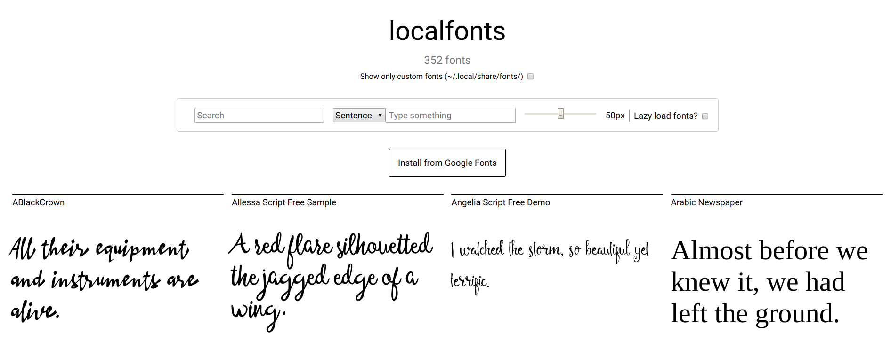

# localfonts

There is no such thing as a good font explorer. Unless this one, of course.



# Dependencies

- [gfonts](https://github.com/MrYakobo/gfonts)
- php
- coreutils
- fc-list from [fontconfig](https://www.freedesktop.org/wiki/Software/fontconfig/)

# Try it

`curl -L git.io/localfonts | sh`

# Install it

```bash
curl git.io/localfonts > ~/bin/localfonts
chmod +x ~/bin/localfonts
localfonts
```

# Credits

This project is loosely based on [this](https://askubuntu.com/a/1005724/) AskUbuntu answer. The UI is shamelessy inspired from the excellent [Google Fonts](https://fonts.google.com).
